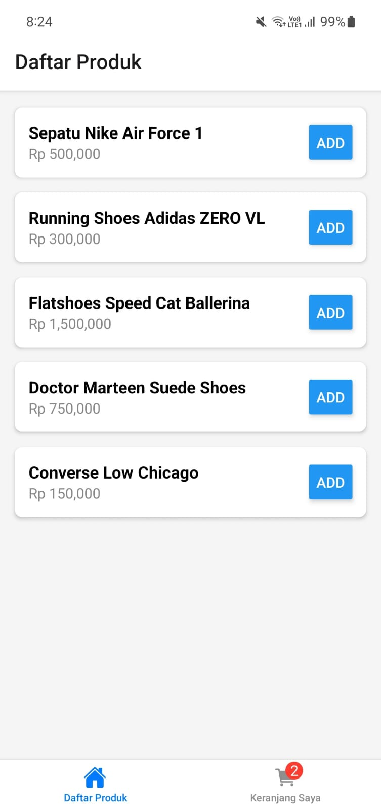
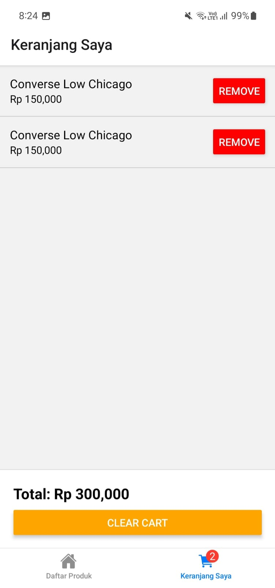

## E-Commerce Cart

- **Nama** : Zulfikar Hasan  
- **NIM** : 2410501016  

---

## State Management

1. **Redux Toolkit Components**
- ```createSlice```: Digunakan untuk menyatukan logika initial state, reducers, dan actions dalam satu tempat (***cartSlice.js***). Ini memudahkan pengelolaan
  penambahan, penghapusan, dan pengosongan item di keranjang.
- ```configureStore```: Menyatukan semua reducer ke dalam satu central store global.
- ```useDispatch```: Hook untuk mengirimkan action dari komponen UI ke store.
- ```useSelector```: Hook untuk mengambil data dari state global secara real-time.
- ```Hydration Logic```: Reducer khusus yang berfungsi untuk memasukkan kembali data dari penyimpanan lokal ke dalam state Redux saat aplikasi pertama kali dimuat.

2. **Middleware & Persistence**
- ```AsyncStorage```: Digunakan sebagai penyimpanan lokal di perangkat mobile. Komponen ini memastikan data keranjang tidak hilang meskipun aplikasi ditutup atau di-restart.
- ```Custom Persistence Logic```: Fungsi utilitas untuk melakukan sinkronisasi otomatis antara state Redux dan AsyncStorage setiap kali terjadi perubahan data pada keranjang.

---

## Screenshot Preview

<p>
  
  
</p>


---
### Bonus
- **Badge jumlah item di tab Cart**
- **Persist state ke AsyncStorage**
